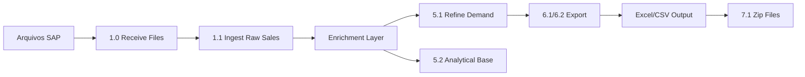

# 🏍️ Honda Demand Analytics - Databricks

**Sistema de Análise e Apuração de Demanda de Peças**  
**Divisão:** Honda Peças - Planejamento  
**Plataforma:** Databricks (Azure)

---

## 📋 Visão Geral

Pipeline de dados end-to-end para processamento, análise e exportação de demanda de peças automotivas da Honda, implementado em Databricks usando arquitetura medalhão (Raw → Trusted → Refined).

### 🎯 Objetivos

* **Consolidar** dados de ordens de venda (SAP) com informações de cadastro, clientes e centros de distribuição
* **Agregar** demanda por múltiplas dimensões (produto, praça, tipo, temporal)
* **Exportar** relatórios estruturados para análise de planejamento (Excel/CSV)
* **Automatizar** pipelines de ingestão e transformação com Delta Lake

---

## 🏗️ Arquitetura

### Camadas de Dados (Medalhão)

```
┌──────────────────────────────────────────────────────────────────┐
│ RAW (Bronze)                                                     │
│ • Ordens de venda SAP                                            │
│ • Dados de cliente (KNVV, KNA1)                                  │
│ • Arquivos brutos recebidos                                      │
└────────────────────────┬─────────────────────────────────────────┘
                         │
                         v
┌──────────────────────────────────────────────────────────────────┐
│ TRUSTED (Silver)                                                 │
│ • Material Cadastrão (enriquecimento)                            │
│ • Material Cadeia (hierarquia de produtos)                       │
│ • Cliente SAP (enriquecimento)                                   │
└────────────────────────┬─────────────────────────────────────────┘
                         │
                         v
┌──────────────────────────────────────────────────────────────────┐
│ REFINED (Gold)                                                   │
│ • refined_demand_*_{HDA|HAB} (por segmento de negócio)           │
│   - fechada, fechada_sem_zesp, aberta, linha                     │
│   - mi, me, me_sem_zesp                                          │
│   - zpug, zpug_cliente, distribuicao                             │
│ • demand_analytical_base (base analítica unificada)              │
└──────────────────────────────────────────────────────────────────┘
```

### Fluxo de Processamento



---

## 📂 Estrutura do Projeto

```
Honda_Demand_Databricks/
├── 01_Demand/            ← Pipeline de demanda (ativo)
├── 02_CadFechamento/     ← Cadastro e Fechamento (planejado)
├── 03_Baseline/          ← Baseline de previsão (planejado)
├── 04_Forecast/          ← Forecast (planejado)
├── skills/               ← Skills do assistente
└── README.md
```

## 📂 Estrutura de Notebooks

### 🔵 1. Ingestão (Raw Layer)

| Notebook | Propósito | Input | Output |
|----------|-----------|-------|--------|
| `1.0_receive_and_move_files` | Recebe e organiza arquivos brutos | Storage externo | `/raw/files/` |
| `1.1_ingest_raw_sales_order` | Ingestão de ordens de venda | Arquivos SAP | `raw_sales_order` |

### 🟢 2. Enriquecimento (Trusted Layer)

| Notebook | Propósito | Input | Output |
|----------|-----------|-------|--------|
| `2.1_ingest_refined_material_cadastrao` | Cadastro base de materiais | Planilhas mestre | `material_cadastrao` |
| `3.1_ingest_refined_material_cadeia` | Hierarquia de produtos | Cadeia SAP | `material_cadeia` |
| `4.1_ingest_customer_knvv_sap` | Dados de vendas do cliente | SAP KNVV | `knvv_sap` |
| `4.2_ingest_customer_kna1_sap` | Dados mestre do cliente | SAP KNA1 | `kna1_sap` |

### 🟡 3. Processamento (Refined Layer)

| Notebook | Propósito | Janela Temporal | Output |
|----------|-----------|-----------------|--------|
| `5.1_refined_demanda_fechamento` | Apuração principal (v2 consolidado) | 60 meses (configurável) | `refined_demand_*_{HDA\|HAB}` |
| `OLD_5.1_refined_demanda_fechamento` | Apuração v1 (legado, usa spark.conf) | 48 meses fixos | `refined_demand_*` |
| `5.2_demand_analytical_base` | Base analítica unificada | 60 meses (configurável) | `demand_analytical_base` |
| `7.1_zip_exported_demand_files` | Compacta exportações em ZIP | N/A | Arquivo `.zip` no Volume |

### 🔴 4. Exportação

| Notebook | Propósito | Formato | Observações |
|----------|-----------|---------|-------------|
| `6.1_export_demand_to_csv.py` | Exportação CSV | CSV | Volumes grandes |
| `6.2_export_demand_to_xlsx.py` | Exportação Excel v1 | XLSX | Uma aba por praça |
| `6.2_export_demand_to_xlsx_v2.py` | Exportação Excel v2 | XLSX | Multi-sheet otimizado |

---

## 🔧 Tecnologias

* **Plataforma:** Databricks (Azure)
* **Compute:** Serverless (default) / All-Purpose Clusters
* **Storage:** Delta Lake
* **Linguagens:** Python 3.x, SQL, Shell
* **Bibliotecas:** 
  * PySpark (processamento distribuído)
  * Pandas (manipulação local)
  * openpyxl/xlsxwriter (exportação Excel)
  * python-dateutil (manipulação de datas)

---

## 🚀 Como Executar

### Pré-requisitos

1. **Workspace Databricks** configurado
2. **Unity Catalog** ativo
3. **Schema destino:** `parts_hdbk_sandbox.pr_demand`
4. **Permissões:** READ nas tabelas raw/trusted, WRITE no schema refined

### Ordem de Execução

```bash
# 1. Ingestão de ordens de venda (mensal)
1.0_receive_and_move_files
1.1_ingest_raw_sales_order

# 2. Enriquecimento (sob demanda / semanal)
2.1_ingest_refined_material_cadastrao
3.1_ingest_refined_material_cadeia
4.1_ingest_customer_knvv_sap
4.2_ingest_customer_kna1_sap

# 3. Processamento de demanda (mensal)
5.1_refined_demanda_fechamento     # Versão principal (v2 consolidado)
5.2_demand_analytical_base         # Base analítica (opcional)

# 4. Exportação (sob demanda)
6.2_export_demand_to_xlsx_v2       # Excel recomendado
7.1_zip_exported_demand_files      # Compactação ZIP (opcional)
```

### Configurações Importantes

**5.1 - Janelas Temporais:**
```python
JANELA_MESES = 60              # Demanda geral (60 meses / 5 anos)
JANELA_MESES_ZPUG_CLI = 12     # ZPUG por Cliente (12 meses)
```

**Schema Unity Catalog:**
```sql
CATALOG: parts_hdbk_sandbox
SCHEMA: pr_demand
```

---

## 📊 Dimensões de Análise

### Segmentação de Mercado

* **HDA (Honda da Amazônia)** - Org Vendas: 0200
* **HAB (Honda Automóveis do Brasil)** - Org Vendas: 0300

### Praças (Centros de Distribuição)

* **TTL** - Consolidado Brasil
* **0203** - Sumaré-SP (2W)
* **0209** - Jaboatão dos Guararapes-PE (2W)
* **0232** - Manaus-AM (2W)
* **0503** - Sumaré-SP (4W)
* **0505** - Jaboatão dos Guararapes-PE (4W)


### Tipos de Demanda

| Tipo | Descrição | Uso |
|------|-----------|-----|
| **Fechada** | Pedidos agrupados por item principal da cadeia | Planejamento geral |
| **Fechada sem ZESP** | Mesma lógica, excluindo tipo_ov='ZESP' | Remove pedidos iniciais de exportação |
| **Aberta** | Pedidos sem agrupamento (por SKU) | Intenção original de compra |
| **Linha** | Contagem de linhas por item principal da cadeia | Volume de pedidos por produto |
| **MI** | Mercado Interno (canal_dist='01') | Demanda doméstica |
| **ME** | Mercado Externo (canal_dist='02') | Demanda de exportação |
| **ME sem ZESP** | Mercado Externo excluindo tipo_ov='ZESP' | Exportação sem pedidos iniciais |
| **ZPUG** | Pedido Urgente de Garantia | Planejamento geral |
| **ZPUG/Cliente** | ZPUG detalhado por emissor da ordem | Análise de garantia por cliente |
| **Distribuição** | Por centro e por canal de vendas | Análise estratégica para Forecast |

---

## 📐 Padrões de Código

Este projeto segue os **Padrões de Arquitetura Databricks** documentados em:

📘 [`notebook_architecture_standards.md`](notebook_architecture_standards.md)

### Convenções

* ✅ **Célula inicial completa** (PROPÓSITO → ARQUITETURA → OUTPUT)
* ✅ **Docstrings Google-style** em todas as funções
* ✅ **Nomenclatura snake_case** (Python/SQL)
* ✅ **Separadores visuais** para seções
* ✅ **Comentários de negócio** explicando o "por quê"

---

## 🔄 Reorganização Recente

Notebooks renomeados/consolidados:

* ✅ `5.1_v2` → consolidado em `5.1_refined_demanda_fechamento` (versão principal)
* ✅ `5.1` (v1 original) → renomeado para `OLD_5.1_refined_demanda_fechamento`
* ✅ `5.2_refined_demanda_ai_agent` → renomeado para `5.2_demand_analytical_base`

Notebooks adicionados:

* ✅ `7.1_zip_exported_demand_files` — compacta exportações em ZIP

Notebooks legados (mantidos para referência):

* 📦 `99_ingest_raw_sales_order_historical` (importação histórica one-time)
* 📦 `99_nb_sales_order_support_functions` (funções de suporte)

Pastas de arquivo:

* 📁 `_old_2026_08`, `_old_2026-08-10` — versões anteriores arquivadas

---

## 🛡️ Boas Práticas

### Compute Serverless

* ⚠️ **Não usar `spark.conf.set()`** em SQL direto (use widgets/parâmetros)
* ✅ **Preferir `5.1_refined_demanda_fechamento`** (compatível serverless) ao invés do `OLD_5.1`

### Delta Lake

* ✅ **OPTIMIZE + ZORDER** em colunas de filtro frequente (`data`, `org_vendas`)
* ✅ **Vacuum** periódico (retenção 7 dias)

### Performance

* ✅ **Broadcast joins** em tabelas pequenas (`material_cadeia`, `kna1_sap`)
* ✅ **Partition by** data em tabelas raw/refined
* ✅ **Cache** em DataFrames reutilizados

---

## 🐛 Troubleshooting

### Problema: "Compute serverless não suporta spark.conf"

**Solução:** Usar `5.1_refined_demanda_fechamento` (versão consolidada) ao invés do `OLD_5.1`.

### Problema: "Exportação Excel ultrapassa limite de linhas"

**Solução:** Ajustar `JANELA_MESES_ZPUG_CLI` para 12 meses no notebook 5.1.

### Problema: "Tabela refined não encontrada"

**Solução:** Verificar execução prévia do 5.1 e permissões no schema:
```sql
GRANT SELECT, MODIFY ON SCHEMA parts_hdbk_sandbox.pr_demand TO `user@domain.com`;
```

---

## 📝 Changelog

### [2026-09-03] - Consolidação e Nova Base Analítica

**Adicionado:**
* `5.2_demand_analytical_base` — base analítica unificada com mapeamento padronizado
* `7.1_zip_exported_demand_files` — compactação ZIP das exportações
* Novas pastas de projeto: `02_CadFechamento`, `03_Baseline`, `04_Forecast`

**Alterado:**
* `5.1_v2` consolidado como `5.1_refined_demanda_fechamento` (versão principal)
* V1 original renomeado para `OLD_5.1_refined_demanda_fechamento`
* `5.2_refined_demanda_ai_agent` → `5.2_demand_analytical_base`
* Janela temporal ampliada de 24 para 60 meses (5 anos de histórico)
* Tabelas de saída segmentadas por negócio: sufixo `_HDA` (2W) e `_HAB` (4W)
* Novos tipos de demanda: Fechada sem ZESP, Linha, ME sem ZESP, ZPUG/Cliente

### [2026-08-09] - Refatoração Estrutural

**Adicionado:**
* Nova versão `5.1_v2` com janelas temporais configuráveis
* Janela específica de 12 meses para ZPUG por Cliente
* Exportador Excel v2 (`6.2_v2`) com melhor performance

**Alterado:**
* Janela temporal geral reduzida de 48 para 24 meses (performance)
* Convertidos notebooks críticos para `.py` (melhor diff em Git)

**Removido:**
* Notebooks históricos e de suporte legado (`99_*`)
* Versões `.ipynb` duplicadas (mantidas apenas `.py`)

---

## 👤 Contato

**Autor:** André Causs  
**Departamento:** Demand Planning  
**Divisão:** Honda Parts Division  
**Email:** andrecauss@gmail.com; andrecauss88@gmail.com; andre_causs@honda.com.br

---

## 📄 Licença

Uso interno - Honda Parts Division  
© 2026 Honda Motor Co., Ltd.
